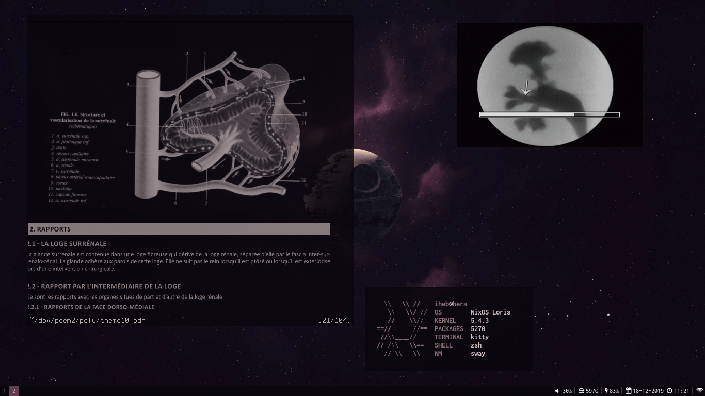

# dotfiles
The entire system, including home directory dotfiles are declaratively managed with nix only using NixOS and home-manager.
This means that if you have nixos just git clone this into /etc/nixos and then type nixos-rebuild switch my entire configuration should be recreated.

You might want to change variables.nix to specify your username and your custom nixos config directory in case you use one
Also hardware.nix will probably not work if you don't use the same hardware as me so you'll have to change it a bit

I save my secrets in the users/private directory with a file called secrets.nix (not in this repo for obvious reasons). This file is then imported into my user file which is mainuser.nix.

I use the nixos stable channel 20.03

