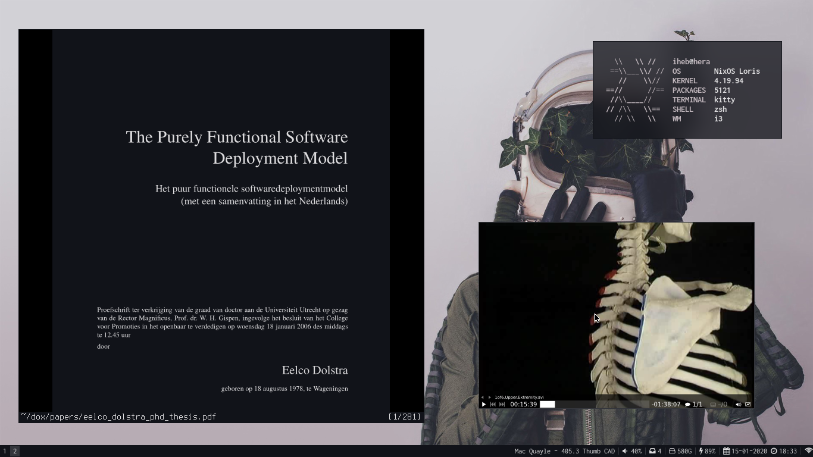

# dotfiles
If you have nixos just put copy /etc/nixos and then type nixos-rebuild switch.
The rest are dotfiles you copy into your home directory

I use multiple channels that need to be setup on first install

```
# sudo nix-channel --list
nixos https://nixos.org/channels/nixos-19.09
nur https://github.com/ihebchagra/nur-packages/archive/master.tar.gz
stable https://nixos.org/channels/nixos-19.09
unstable https://nixos.org/channels/nixos-unstable
```


